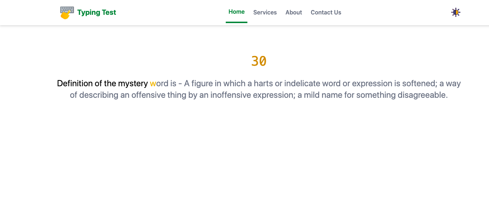
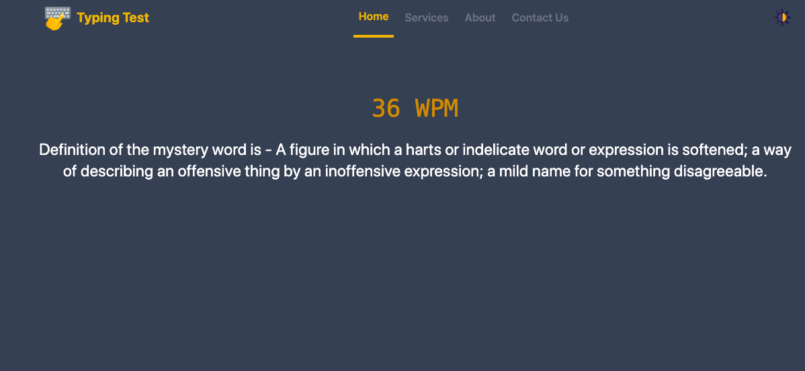

# Typing Test
## Typing Speed & Vocabulary Trainer

An interactive typing speed test that not only measures your **WPM (Words Per Minute)** but also helps you **learn new vocabulary** along the way. Each word you type comes with a definition fetched from a free dictionary API, turning a simple typing test into an engaging learning experience.

🎮 **Test your speed**  
📚 **Learn new words**  
🌓 **Light/Dark mode for comfortable typing**  
⚡ **Fast, responsive, and built for the web**

---

## 🚀 Try It Out

👉 **Live Demo:** [Click here to play](https://typingtest-natnaeldesta.netlify.app/)  

---

## ✨ Features

- **Real-time WPM calculation**
- **Vocabulary learning integration** using a free definition API
- **Light/Dark mode toggle** for accessibility and comfort
- **Responsive UI** optimized for all screen sizes
- **Smooth typing flow** with automatic word cycling
- **Minimal, distraction-free design**

---

## 🧠 How It Works

1. The app fetches a list of words using a free dictionary API.
2. Users type each word as fast and accurately as possible.
3. The UI displays the definition so users learn meaning while typing.
4. WPM is calculated continuously based on typed characters and elapsed time.

---

## 🛠️ Tech Stack

- **Frontend:** JavaScript, HTML, CSS (or your chosen framework)
- **API:** Free dictionary API
- **Design:** Responsive layout with theme toggle

---

## 📸 Screenshots

### 🖥️ Main Typing UI  

### 🔦 Dark Mode Preview  

---
